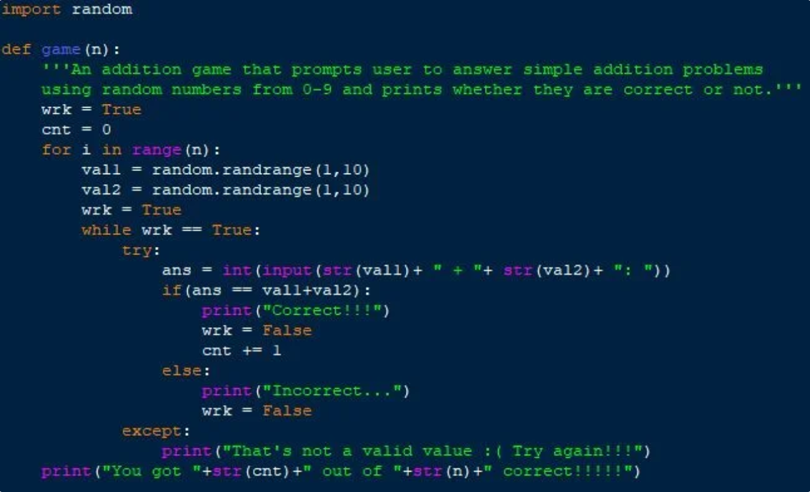

PROGRAMMING 

## **Overview**
This repo contains programming langauges, coding exercises, courses, and hackathons that have helped me in my Programming journey. This is more so to document my learning experience along the way. If the organization of content helps someone else in their Programming journey then even better.

# **Table Of Contents**

### **Programming Languages**
1. [TBD]()

### **Coding exercises**
1. [TBD]()

### **Courses**
1. [TBD]()

### **Hackathons**
1. [TBD]()